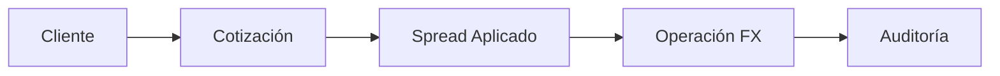
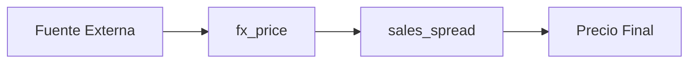
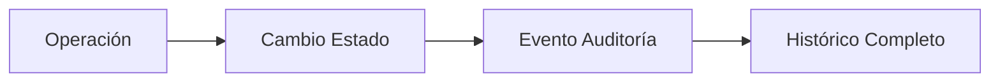

# 📊 Base de Datos PriceFlowFX

## Descripción General

**PriceFlowFX** es una plataforma profesional de trading de divisas (Foreign Exchange) que gestiona operaciones **Spot** y **Forward** con integración a sistemas externos de precios y auditoría completa.

## 🏗️ Arquitectura de la Base de Datos

### **Características Principales:**
- ✅ **24 tablas especializadas** en trading FX
- ✅ **Event Sourcing** completo para auditoría
- ✅ **Soft Delete** en lugar de eliminación física
- ✅ **Integración con sistemas externos** (Bloomberg, Reuters, Datatec)
- ✅ **Gestión de spreads dinámicos** por segmento y escenario
- ✅ **Soporte multi-divisa** con precios BID/MID/OFFER

---

## 📋 Catálogo de Tablas

### 👥 **Módulo de Usuarios y Seguridad**

| Tabla | Propósito | Registros Típicos |
|-------|-----------|-------------------|
| `app_user` | Usuarios del sistema | 50-200 usuarios |
| `user_profile` | Perfiles de acceso | Admin, Trader, Sales, Viewer |
| `sales_group` | Grupos de ventas | Retail, Corporate, Private |
| `app_parameter` | Configuración del sistema | ~100 parámetros |

### 🏢 **Módulo de Clientes**

| Tabla | Propósito | Registros Típicos |
|-------|-----------|-------------------|
| `client` | Clientes de la plataforma | 1,000-10,000 clientes |
| `segment` | Segmentación comercial | Retail, Corporate, Institutional |
| `client_external_id` | IDs externos de clientes | N:1 con clientes |
| `app_user_external_id` | IDs externos de usuarios | N:1 con usuarios |

### 💰 **Módulo de Divisas**

| Tabla | Propósito | Registros Típicos |
|-------|-----------|-------------------|
| `currency` | Catálogo de divisas | ~150 divisas mundiales |
| `country` | Países | ~200 países |
| `currency_country` | Relación divisas-países | Relación N:M |
| `holiday` | Feriados por país | ~2,000 registros/año |

### 📈 **Módulo de Trading FX**

| Tabla | Propósito | Registros Típicos |
|-------|-----------|-------------------|
| `fx_operation_spot` | Operaciones al contado | Miles por día |
| `fx_operation_forward` | Operaciones a plazo | Cientos por día |
| `fx_operation_status` | Estados de operaciones | Pendiente, Completa, Anulada |
| `fx_product` | Productos FX | Spot, Forward, Swap |
| `quote_origin` | Origen de cotizaciones | Web, Mesa, App, API |
| `operation_folder` | Organización de operaciones | Folders de trading/sales |

### 💹 **Módulo de Precios**

| Tabla | Propósito | Registros Típicos |
|-------|-----------|-------------------|
| `fx_price` | Precios históricos | Millones de registros |
| `sales_spread` | Spreads por segmento | Miles de configuraciones |
| `trading_spread_range` | Spreads por monto | Rangos escalonados |
| `market_scenario` | Escenarios de mercado | Normal, Volátil, Extremo |

### 📋 **Módulo de Auditoría**

| Tabla | Propósito | Registros Típicos |
|-------|-----------|-------------------|
| `fx_operation_spot_event` | Eventos de operaciones Spot | Histórico completo |
| `fx_operation_forward_event` | Eventos de operaciones Forward | Histórico completo |

---

## 🔄 Flujos de Datos Principales

### **1. Proceso de Trading**


### **2. Gestión de Precios**


### **3. Event Sourcing**


---

## 🎯 Casos de Uso Principales

### **Trading Spot**
- Cliente solicita cotización USD/CLP
- Sistema consulta `fx_price` + `sales_spread`
- Se crea registro en `fx_operation_spot`
- Eventos se registran en `fx_operation_spot_event`

### **Trading Forward**
- Similar a Spot + campos específicos:
  - `forward_expiry_date`
  - `tenor_days`
  - `forward_points`
  - `settlement_currency_id`

### **Integración Externa**
- Sistemas externos envían precios
- Se almacenan en `fx_price`
- IDs externos se mapean en `*_external_id`

---

## 📊 Consideraciones de Performance

### **Índices Críticos**
- `fx_operation_spot(client_id, value_date)`
- `fx_price(currency_id, price_date)`
- `fx_operation_*_event(event_timestamp)`

### **Particionamiento Recomendado**
- `fx_price` por mes/año
- `fx_operation_*_event` por trimestre
- `fx_operation_*` por año

### **Retención de Datos**
- Operaciones: **7 años** (regulatorio)
- Precios: **5 años** (análisis)
- Eventos: **Permanente** (auditoría)

---

## 🔐 Seguridad y Auditoría

### **Patrón de Auditoría**
Todas las tablas principales incluyen:
```sql
created_by INTEGER NOT NULL REFERENCES app_user(id)
created_at TIMESTAMP DEFAULT NOW()
modified_by INTEGER REFERENCES app_user(id)
modified_at TIMESTAMP
```

### **Event Sourcing**
- Cada operación genera eventos inmutables
- Histórico completo de cambios de estado
- Trazabilidad completa para compliance

### **Soft Delete**
- Campo `status` en lugar de DELETE físico
- Preserva integridad referencial
- Permite auditorías históricas

---

## 🚀 Configuración e Instalación

### **Requisitos**
- PostgreSQL 13+
- Extensiones: `uuid-ossp` (opcional)

### **Instalación**
```bash
# 1. Crear base de datos
createdb priceflowfx

# 2. Ejecutar scripts en orden
psql -d priceflowfx -f db/init/tables/*.sql

# 3. Insertar datos maestros
psql -d priceflowfx -f db/init/data/*.sql
```

### **Variables de Entorno**
```env
DB_HOST=localhost
DB_PORT=5432
DB_NAME=priceflowfx
DB_USER=fx_user
DB_PASSWORD=secure_password
```

---

## 📈 Métricas y Monitoreo

### **KPIs de Base de Datos**
- **Operaciones/día**: 1,000-10,000
- **Consultas de precios/minuto**: 100-1,000
- **Tamaño típico**: 50GB-500GB/año
- **Tiempo de respuesta**: <100ms operaciones críticas

### **Monitoreo Recomendado**
- Conexiones activas
- Queries lentas (>1s)
- Espacio en disco
- Réplicas de lectura para reporting

---

## 🔧 Mantenimiento

### **Tareas Periódicas**
- **Diario**: Backup completo
- **Semanal**: VACUUM/ANALYZE
- **Mensual**: Revisión de índices
- **Trimestral**: Archivado de datos históricos

### **Troubleshooting Común**
- **Locks largos**: Revisar `fx_operation_*_event`
- **Espacio**: Particionar tablas grandes
- **Performance**: Revisar índices en `fx_price`

---

## 📞 Soporte

Para dudas técnicas sobre la base de datos:
- 📧 Email: dba@priceflowfx.com  
- 📋 Issues: GitHub Issues
- 📖 Wiki: Documentación interna

---

*Última actualización: Enero 2025*